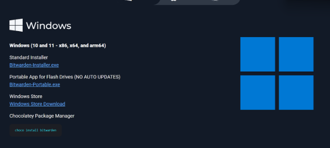
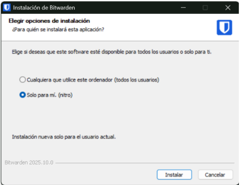
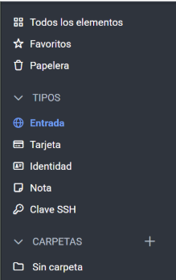
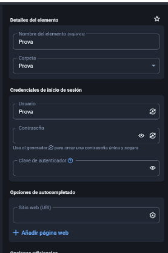
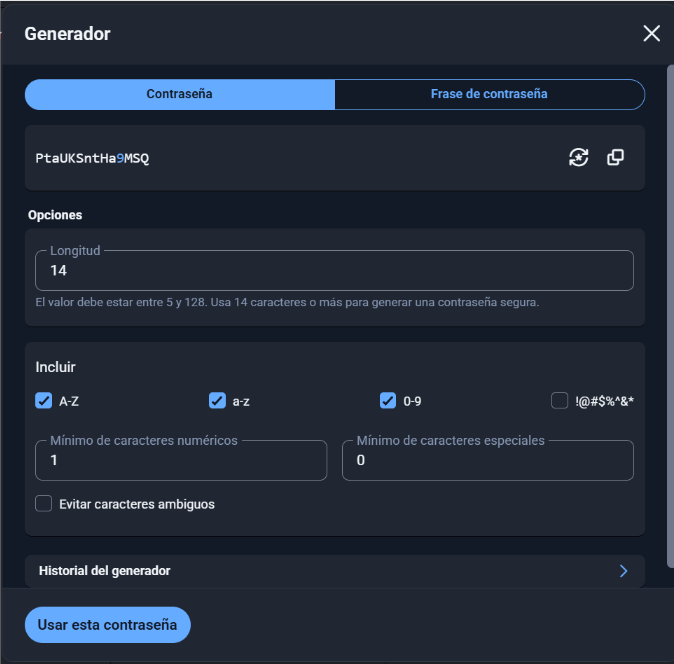

# 🧩 T01: GESTOR DE CONTRASENYA

**CFGM SISTEMES MICROINFORMÀTICS I XARXES 2B**  
**Nezar Mghari Boussaada**

---

### T01: GESTOR DE CONTRASENYA 1

#### Fase 1: Anàlisi i Justificació (Document d'Informe) 3
1. Introducció i Justificació 3  
2. Anàlisi i Comparativa Tècnica de les Alternatives 4  
3. Avantatges i Inconvenients 5  

#### Fase 2: Guia d'Ús Tècnica (Manual Operatiu) 6
1. Instal·lació 6  
2. Generador de contrasenyes 7  

---

## ⚠️ Alerta!!

**EverPia** ha estat atacada per **ciberdelinqüents**.  
La consultora on esteu de becaris ha patit una **fuita d’informació (data breach)** i informació confidencial sobre un projecte que està en fase de desenvolupament està ara en mans de delinqüents que amenacen amb publicar-la si no es paga un rescat.

Òbviament, això ha causat una gran alarma dins la companyia i s’ha creat un **comitè de crisi** per gestionar la situació.  
La investigació interna ha revelat que un dels comptes tècnics va ser compromès a causa de l'ús d'una **contrasenya feble o reutilitzada**.

---

## 🧭 Directriu de la Direcció Tècnica

Com a resposta a aquesta crisi, la Direcció Tècnica ha emès una directriu:  
> Tot el personal tècnic ha de començar a utilitzar un **gestor de contrasenyes validat** per garantir l'ús de **credencials úniques i robustes**.

Se us encarrega la tasca d'avaluar les opcions i crear la documentació necessària per a la formació del personal.

---

## 🧩 Fase 1: Anàlisi i Justificació (Document d'Informe)

### 1. Introducció i Justificació

Les contrasenyes feble o reutilizades suposen un risc molt important per a cualquier empresa. Aquest poden ser facilment descifrades als atacs de diccionari o per *stuffing*, on es tenen llistas automatiques de contrasenya comunes o ja filtrades per accedir als sistemas. Quan aixo passa, posa en perill la seguretat de la empresa i pot afectar tot el negoci.

Per aixo l’us de un gestor de contrasenyas en fundemantal per una bona seguretat, aquestas einas et poden generar i emagatzemar contrasenyas uniques per cada serveis reduint la posiblitat que es produeixin vulneracions causades per contrasenyas febles o repetides.

---

### 2. Anàlisi i Comparativa Tècnica de les Alternatives

Ara compararem els dos gestors de contrasenyes més populars actualment:

#### 🔹 Bitwarden
Bitwarden és un gestor de contrasenyes **online** molt còmode i accessible.  
És molt útil per a equips que necessiten accés ràpid i sincronitzat des de diferents dispositius. Té una seguretat molt robusta, però depèn molt del núvol, que pot tenir vulnerabilitats o caigudes (ja sigui per atacs o per causes normals).

#### 🔹 KeePassX
KeePassX és un gestor de contrasenyes **offline**, i això també té avantatges, com ara tenir un control total sobre les dades i evitar altres dependències.  
Això sí, és més manual i, a més, cal fer diverses còpies de seguretat per assegurar que no es perdi cap dada.

---

### 🧮 Taula comparativa

| **Característica** | **Bitwarden (Online / Núvol)** | **KeePassXC (Offline / Escriptori)** |
|--------------------|---------------------------------|--------------------------------------|
| **Sincronització** | Automàtica entre tots els dispositius (mòbil, web, PC). | No automàtica; cal sincronitzar manualment o amb eines externes. |
| **Model de seguretat** | Xifratge end-to-end, model zero-knowledge (el proveïdor no pot veure les dades). | Xifratge local (AES-256). L’arxiu es guarda al dispositiu de l’usuari. |
| **Accés multi-dispositiu** | Fàcil i immediat amb aplicacions i extensions de navegador. | Possible mitjançant còpies de l’arxiu o sincronització manual. |
| **Cost / Llicència** | Freemium: versió gratuïta amb opcions de pagament per a funcions avançades. | Gratuït i de codi obert (*open source*). |
| **Emmagatzematge** | En el núvol (Bitwarden o servidor propi si s’auto-hospeda). | Arxiu local (.kdbx) sota control de l’usuari o empresa. |
| **Funcionalitats corporatives** | Polítiques d’empresa, compartició d’equips, autenticació 2FA, registre d’activitat. | Limitades; no hi ha gestió centralitzada ni control d’usuaris. |
| **Dependència del núvol** | Sí, però amb alta disponibilitat i còpies de seguretat automàtiques. | No; total independència del núvol. |
| **Continuïtat del negoci** | Alta: fàcil recuperació i accés remot. | Depèn de les còpies de seguretat locals i la gestió interna. |

---

### 3. Avantatges i Inconvenients

#### **Bitwarden (Núvol)**
Bitwarden és molt pràctic i fàcil d’utilitzar.  
Les contrasenyes es sincronitzen automàticament entre dispositius i tothom pot accedir-hi fàcilment, fins i tot treballant en remot.  
També té opcions útils per a equips, com **compartir contrasenyes de forma segura** o **activar la verificació en dos passos**.  
El punt dèbil és que depèn del núvol i d’una bona connexió. Si es volen funcions avançades, pot tenir cost, i si es perd la contrasenya mestra, no hi ha manera de recuperar les dades.

#### **KeePassX (Offline / Escriptori)**
KeePassXC és ideal per a qui vol tenir tot el control i evitar el núvol.  
Les contrasenyes es guarden al teu ordinador i el programa és totalment gratuït.  
A canvi, és menys còmode: cal sincronitzar els fitxers manualment si vols usar-lo en més d’un dispositiu i fer còpies de seguretat per no perdre res.  
També és una mica més tècnic d’utilitzar i no té funcions corporatives automàtiques.

---

### 🧠 Recomanació

Jo et recomanaria **Bitwarden**.  
És fàcil d’utilitzar, segur i et permet tenir totes les contrasenyes sincronitzades a qualsevol dispositiu sense embolics.  
A més, pots compartir credencials amb l’equip de manera controlada i activar la verificació en dos passos per més seguretat.  
En resum: **pràctic, fiable i perfecte per al dia a dia de l’empresa.**

---

## 🧰 Fase 2: Guia d'Ús Tècnica (Manual Operatiu)

### 1. Instal·lació

Ara veurem com instal·lar i utilitzar **Bitwarden**.  

Primer, anem a la pàgina de Bitwarden i accedim a l’apartat **“Downloads”** per instal·lar l’instal·lador de l’aplicació.

A continuació, ens preguntarà si volem instal·lar l’aplicació només per a l’usuari actual o per a tots els usuaris de l’ordinador.  
Això dependrà de les necessitats de l’empresa.

Un cop instal·lat Bitwarden, obrim l’aplicació i ens demanarà iniciar sessió amb un compte.  
Si no en tenim, podem registrar-nos fàcilment.

Amb l’aplicació oberta, et sortiran moltes opcions de tipus diferents:  
et permet gestionar no només comptes, sinó també targetes, informació personal, guardar notes de manera segura i **claus SSH**.

---

### 2. Generador de contrasenyes

Per fer un exemple, anirem a l’apartat **Entrada**; allà veurem moltes opcions i podràs classificar les diferents entrades en carpetes per mantenir-ho ben organitzat.

Li posem l’usuari de la web o aplicació on volem iniciar sessió, i també el **URL** per si volem que l’aplicació ho autocompleti.  
Pel que fa a la contrasenya, la pots crear tu mateix o deixar que l’aplicació te la generi automàticament.

Pots configurar com vols que es generi:  
per exemple, si vols que sigui una **frase llarga** o només **caràcters**, la **longitud** que vols que tingui,  
i també pots consultar l’**historial de contrasenyes generades**.

- [**Solució**](Solucio.md)
- [**Tornar el projecte**](../README.md)
