# 🧩 Servei de Directori LDAP

Configuració i gestió d’un servidor **LDAP** (Lightweight Directory Access Protocol) amb clients **Zorin OS**.  
Pràctica tècnica **T04**.

---

## 1. 🌐 Configuració inicial de la xarxa

Per començar, la xarxa tindrà **dues interfícies**: una per comunicar-se i una altra perquè el client es pugui comunicar amb el servidor.  
- A la **interfície 1** posarem **NAT**.  
- A la **interfície 2** posarem **Host Only**.

Configura els adaptadors a la màquina virtual segons correspongui.

<p align="center">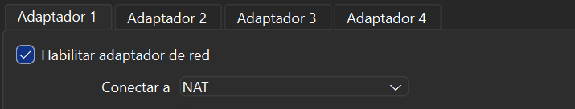</p>

---

## 2. 🛠️ Configuració d’IP i DHCP

Un cop engegat el servidor, podem comprovar la IP amb:

```bash
ip a
```

Si la interfície `enp0s8` no té IP, la configurarem activant el **DHCP** i editant el fitxer de **netplan**:

```bash
sudo nano /etc/netplan/50-cloud-init.yaml
sudo netplan apply
```

<p align="center">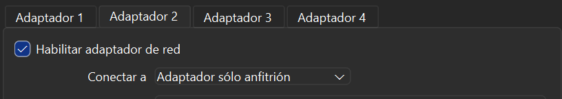</p>

---

## 3. 🔧 Instal·lació del servidor LDAP

Instal·lem els paquets necessaris:

```bash
sudo apt update
sudo apt install slapd ldap-utils -y
```

Durant la instal·lació, ens demanarà una contrasenya per a l’administrador de LDAP.

<p align="center">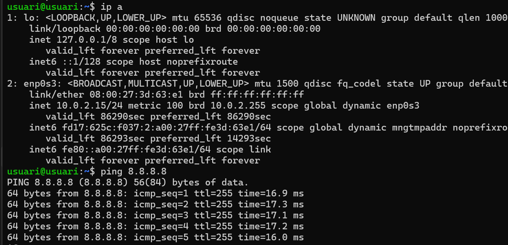</p>

Per comprovar que el servei funciona:

```bash
sudo systemctl status slapd
```

<p align="center">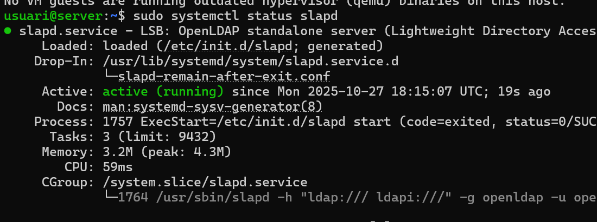</p>

Consultem les entrades amb:

```bash
sudo slapcat | grep dn
```

<p align="center">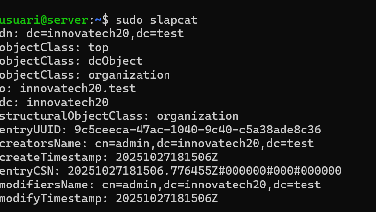</p>

---

## 4. 🧾 Reconfiguració i domini

Per ajustar el domini LDAP:

```bash
sudo dpkg-reconfigure slapd
```

<p align="center">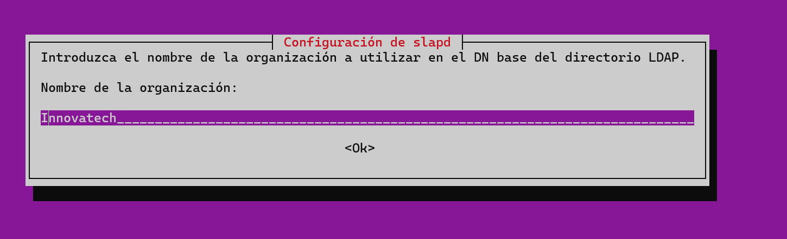</p>

Acceptem la reconfiguració:

<p align="center"></p>

Posem la contrasenya:

<p align="center">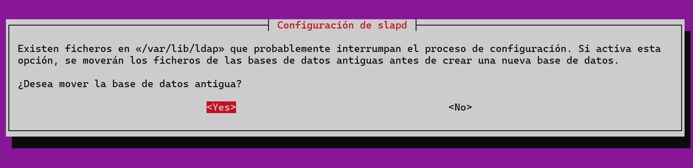</p>

Comprovació:

```bash
sudo slapcat
```

---

## 5. 🗂️ Creació de l’estructura LDAP (LDIF)

Fitxer base LDIF:

<p align="center">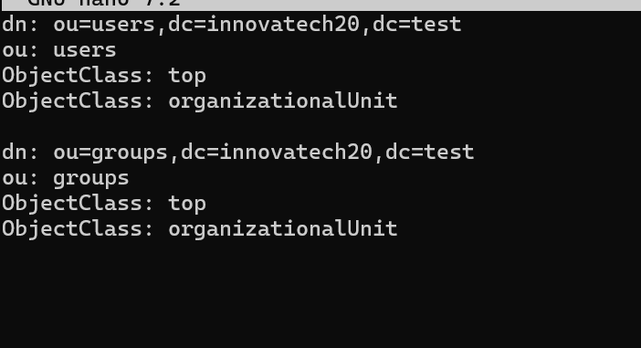</p>

Aplica’l:

```bash
sudo ldapadd -x -D "cn=admin,dc=ldap,dc=local" -W -f base.ldif
```

---

## 6. 🔍 Comprovació de OUs i ús de LAM

Consulta de dades LDAP:

```bash
ldapsearch -x -b dc=ldap,dc=local
```

<p align="center"></p>

Instal·lació del **LDAP Account Manager**:

```bash
sudo apt install ldap-account-manager -y
```

<p align="center"></p>

Accés via navegador:

<p align="center"></p>

Configuració del servidor:

<p align="center">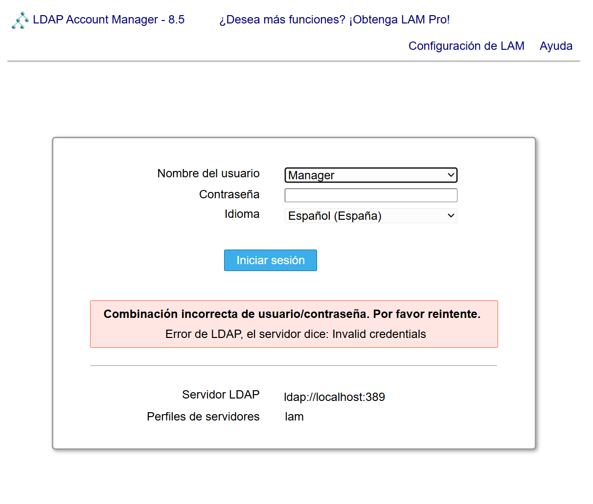</p>

Modificació del sufix del servidor:

<p align="center">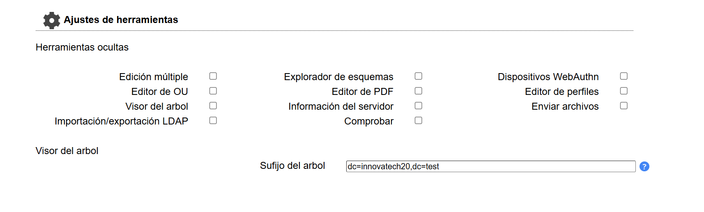</p>

Configuració de grups i usuaris:

<p align="center">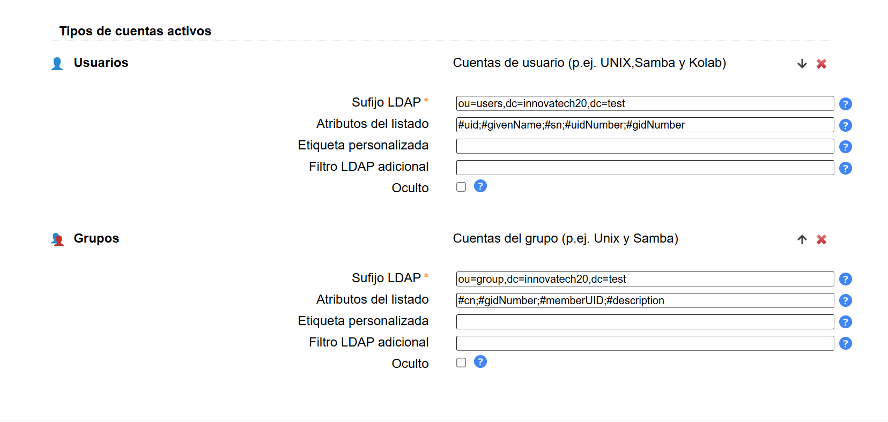</p>

Opció de canvi de contrasenya:

<p align="center">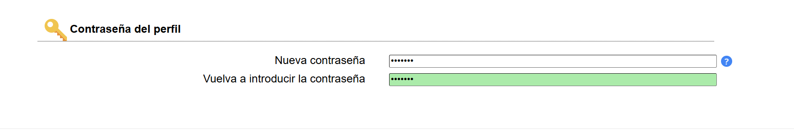</p>

---

## 7. 👥 Creació d’usuaris i grups

Crear nou usuari:

<p align="center">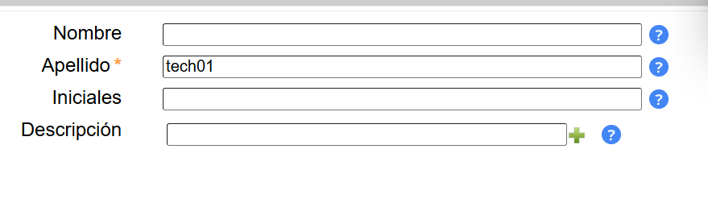</p>

Afegim el cognom *usuari*:

<p align="center">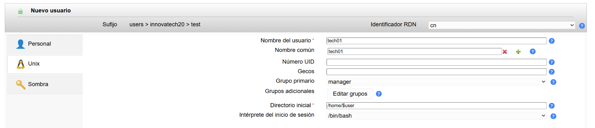</p>

Configuració Unix:

<p align="center">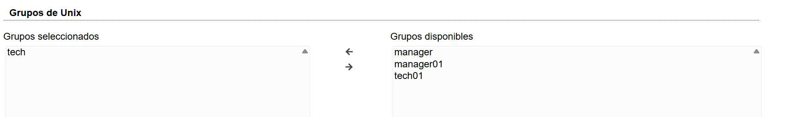</p>

Assignem contrasenya:

<p align="center">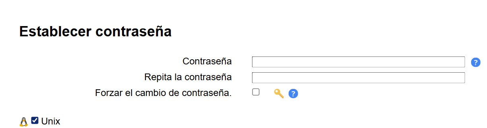</p>

---

## 8. 💻 Configuració del client Zorin

Configura NAT + Host Only:

<p align="center">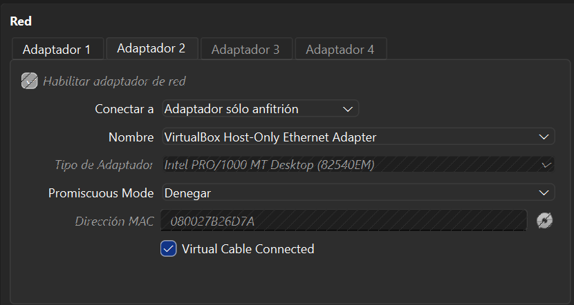</p>

Nom del client:

<p align="center">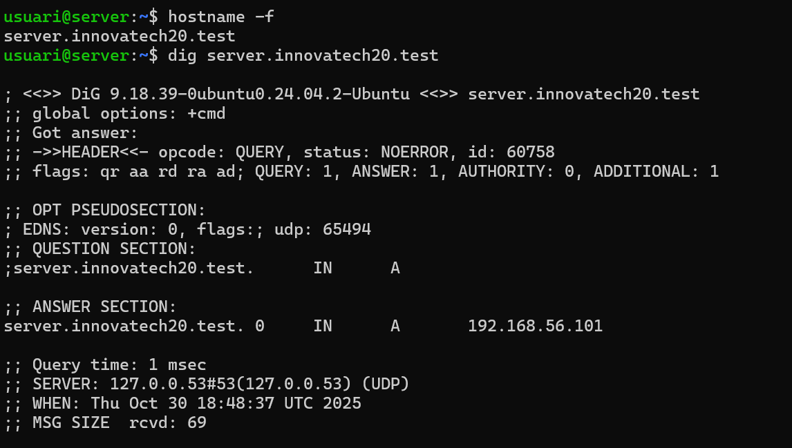</p>

---

## 9. 🧰 Instal·lació del client LDAP

```bash
sudo apt install libnss-ldap libpam-ldap nss-pam-ldapd nscd -y
```

<p align="center">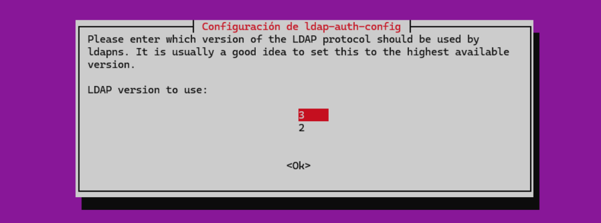</p>

Configuració: posar **sí** on toca.

<p align="center">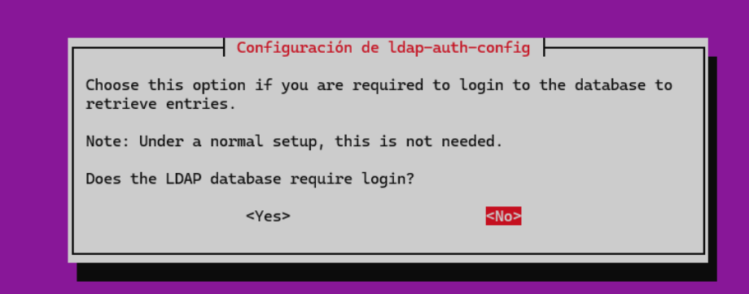</p>

---

## 10. 📄 Configuració d’arxius del sistema

Fitxer `nsswitch.conf`:

<p align="center">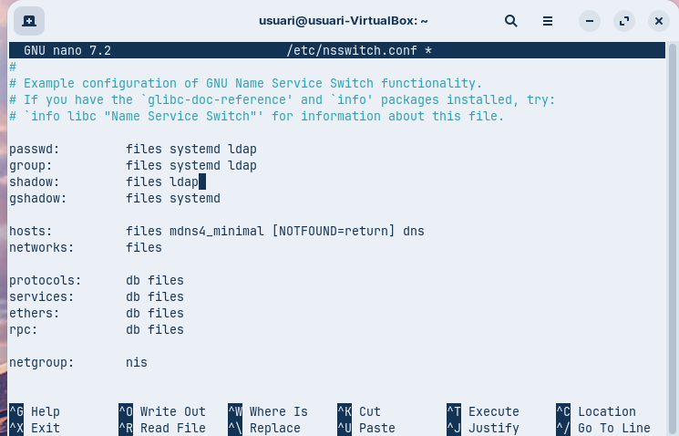</p>

Fitxer `common-session`:

```bash
session required pam_mkhomedir.so skel=/etc/skel umask=077
```

<p align="center">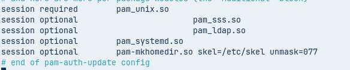</p>

Reinicia:

```bash
sudo systemctl restart nscd
sudo systemctl status nscd
```

---

## 11. ✅ Verificació final

Comprovació d’usuaris:

```bash
getent passwd | tail
```
<p align="center">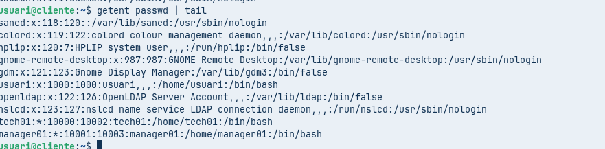</p>

<p align="center"></p>

---

# ✔️ Conclusió

Si tot ha anat bé, el servidor LDAP i el client Zorin funcionen correctament i els usuaris LDAP es poden autenticar sense problemes.

🧩 *Pràctica T04 – Serveis de Directori LDAP completada.*

