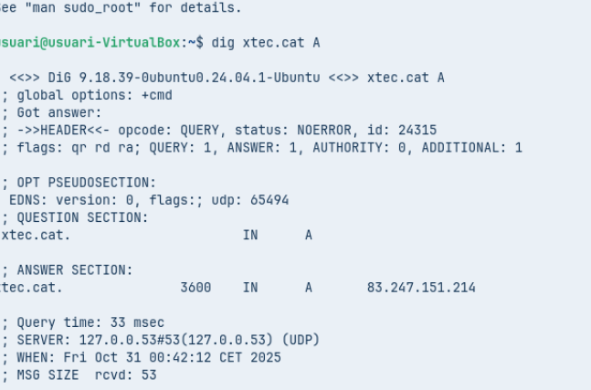
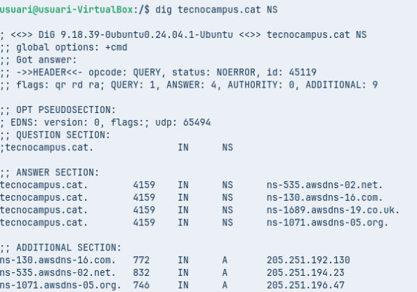
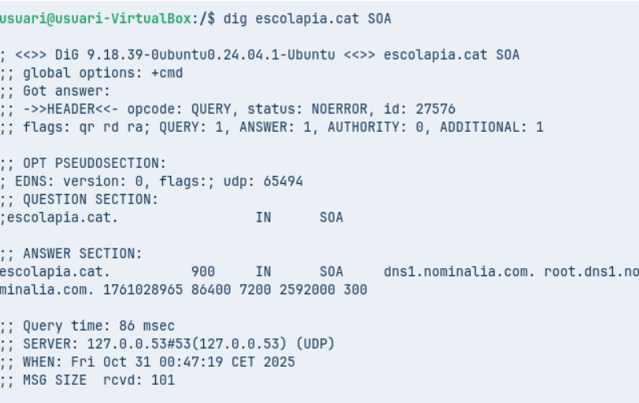
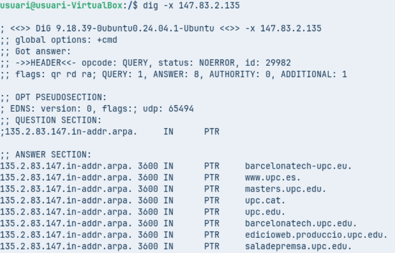
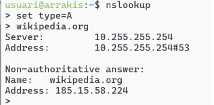
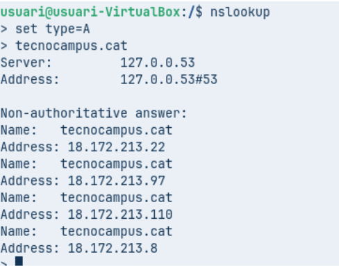
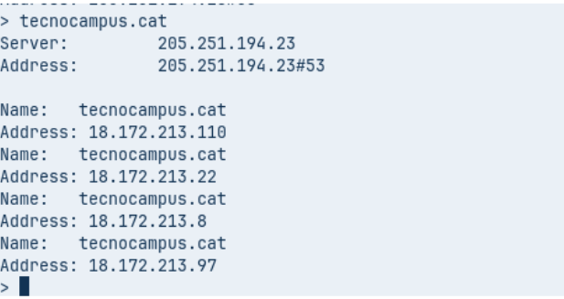

# Fase Pràctica: Diagnosi de Noms (Auditoria amb CLI)

Heu de demostrar l'ús de les principals utilitats de diagnosi DNS en els diferents sistemes operatius que utilitza el client (Linux/macOS i Windows).
Per a cada eina, executeu les comandes indicades a continuació contra el domini que s’indiqui explícitament i captureu/analitzeu els resultats.
Per fer aquest demostració, caldrà usar un equip Zorin amb dues interfícies, la primera en NAT i la segona en adaptador pont amb la IP correctament configurada segons indicacions dels vostres responsables.

---

## A. Diagnosi Avançada amb dig (Linux / macOS)

### **Comanda 1: Consulta Bàsica de Registre A**



```
dig xtec.cat A
```
**Anàlisi:**  
Identifica la IP de resposta, el valor TTL i el servidor que ha respost a la consulta.

- La resposta IP es: **83.247.151.214**
- El TTL: **3600 segons**
- El server que ha respost: **127.0.0.53**

---

### **Comanda 2: Consulta de Servidors de Noms (NS)**



```
dig tecnocampus.cat NS
```
**Anàlisi:**  
Quins són els servidors de noms autoritatius per a aquest domini?  
- *server autoritatius son els de la dreta: per exemple ns-535.awsdns-02.net*

---

### **Comanda 3: Consulta Detallada SOA**



```
dig escolapia.cat SOA
```
**Anàlisi:**  
Quina és la informació del correu de l'administrador i el número de sèrie del domini?

- **El número de serie es: 1761028965**

---

### **Comanda 4: Consulta resolució inversa**



```
dig -x 147.83.2.135
```
**Anàlisi:**  
Quina informació sobre els registres s’obté?

- esquerra: IP (ex: 135.2.83.147)
- dreta: nom (ex: barcelonatech-upc.eu.)

---

## Comprovació de Resolució amb nslookup (Multiplataforma)

L’eina nslookup es troba a pràcticament a qualsevol sistema operatiu. Es pot usar de forma similar a dig incloent l’argument o si s’executa nslookup sense arguments, entrar en el mode interactiu, us apareix un prompt (>). Serà aquest mode el que explorareu.



El mode és força senzill, bàsicament hi ha tres comandes a usar:

- `set type=` per indicar el tipus de consulta: A, AAA, MX, NS, SOA, TXT o ALL.
- `server IP` on IP és la IP del servidor de noms al que es vol fer la consulta, també es pot indicar el nom del servidor enlloc de la IP, per exemple, `server a9-66.akam.net`.
- `exit` que serveix per sortir de la comanda.

---

### **Comanda 1: Consulta Bàsica no Autoritativa**
Seleccionar `type=A` i com a domini de consulta `tecnocampus.cat`



**Anàlisi:**  
Per què indica que la resposta és no autoritativa?

- *La resposta que ha donat no es oficial del domini sino d’un altre dns*

---

### **Comanda 2: Consultes autoritatives**
Escriure `server IP` i escriure la IP del primer servidor de noms del domini `tecnocampus.cat` que s’ha obtingut d’una consulta anterior.

A continuació, indiqueu que voleu consultar registres de tipus A i del domini `tecnocampus.cat`.




---
