# T06: El servei de DHCP – Configuració pràctica

Després de fer la instal·lació d’Ubuntu, hem d’activar la segona interfície i configurar-la en xarxa interna. 

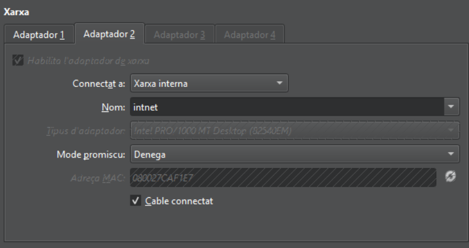

Quan ho tinguis, inicia el servidor, ves a `/etc/netplan` (abans intenta confirmar amb `ip a` quina interfície has de configurar) i obre l’arxiu per modificar-lo. 

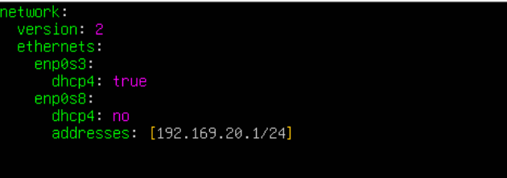

Per aplicar la configuració, hem d’executar `netplan apply` i verificar-ho amb `ip a`.

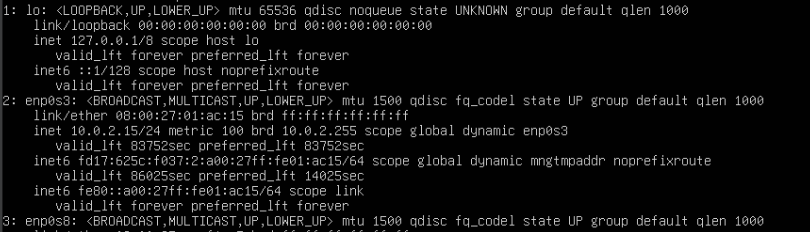

Actualitzem i instal·lem el programa Kea. 

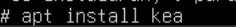

Et sortirà un menú; posa el configured-random-password, ja que no el farem servir. 

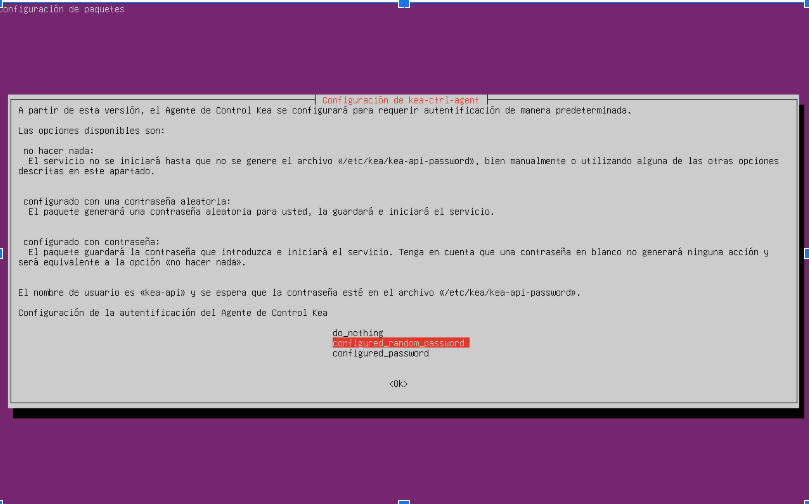

Comprovem que s’hagi instal·lat amb `systemctl status nom_servei`.

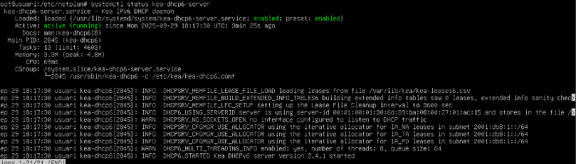

Provem de parar i deshabilitar el servei.

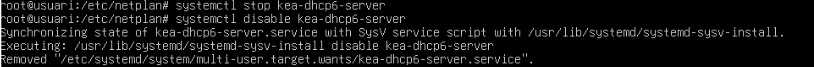

I comprovem si s’ha aturat correctament. 

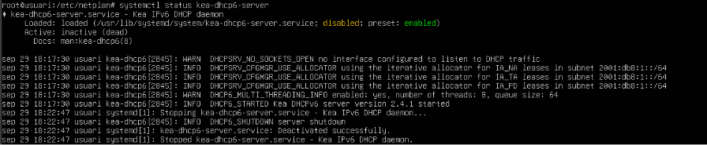

L’iniciem una altra vegada.

Ara hem d’anar a `/etc/kea` i canviar el nom de l’arxiu `kea-dhcp4.conf` a un altre. Després, clonant el repositori o editant-lo tu mateix, modifica l’arxiu amb la següent informació:

- Subxarxa: `192.169.x.0/24` (on x és el teu número de llista)
- Rang: de `192.169.x.100` a `192.169.x.200`
- Porta d’enllaç: `192.169.x.254`
- DNS: `8.8.8.8`

I deshabilitem la IP de reserva, ja que no la farem servir de moment, ja sigui convertint-la en comentari o eliminant-la.

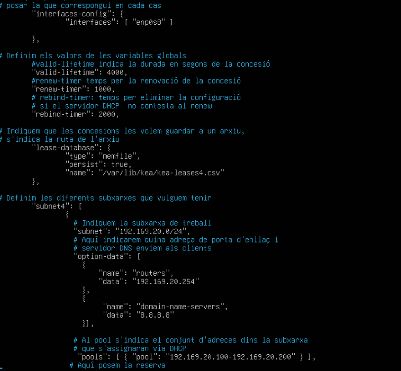

Un cop acabat tot això, ho comprovem amb: `kea-dhcp4 -t kea-dhcp4.conf`

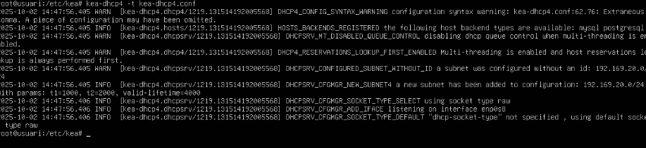

Reiniciem el servei amb `systemctl restart nom_servei` i comprovem amb `systemctl status`.

Ara instal·lem Zorin OS. Un cop instal·lat, entrem a la terminal i fem `ip a` per veure la MAC de la interfície `enp0s8`. Quan ja ho tinguis, edita l’arxiu del servidor Kea i li assignem una IP reservada; a dalt, hi posem la MAC de la màquina Zorin. 

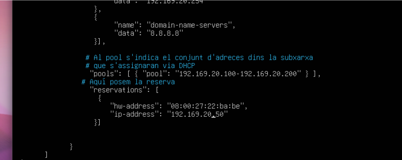

Reiniciem el servei per aplicar els canvis i, al client, desconnectem la segona interfície; hauria de tenir la IP reservada.

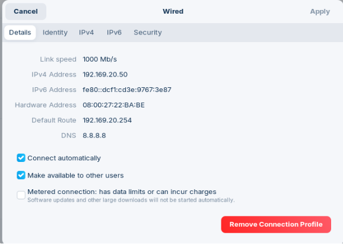

Ara, per a la següent i última activitat, instal·lem Wireshark amb `apt install` i l’obrim amb la comanda `wireshark`. (Abans, a la xarxa interna, desconnecta el cable per fer-ho bé.) Dins l’aplicació, desactiva totes les interfícies menys `enp0s8`.

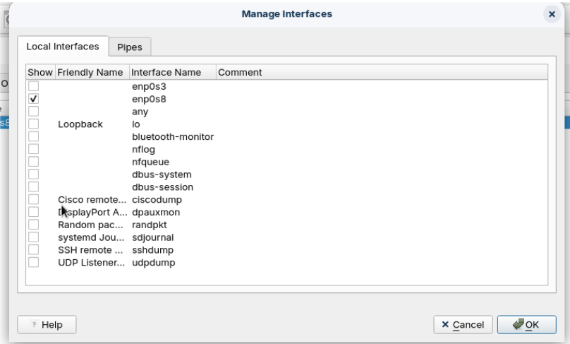

Després, connecta el cable de la interfície 2 i s’hauria de veure com s’assigna una IP a la màquina.

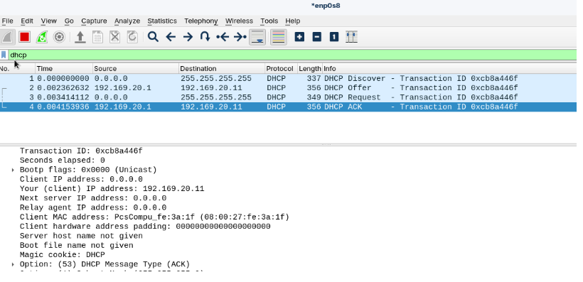

I ja estaria 👍

- [**Tornar al README**](README.md)

